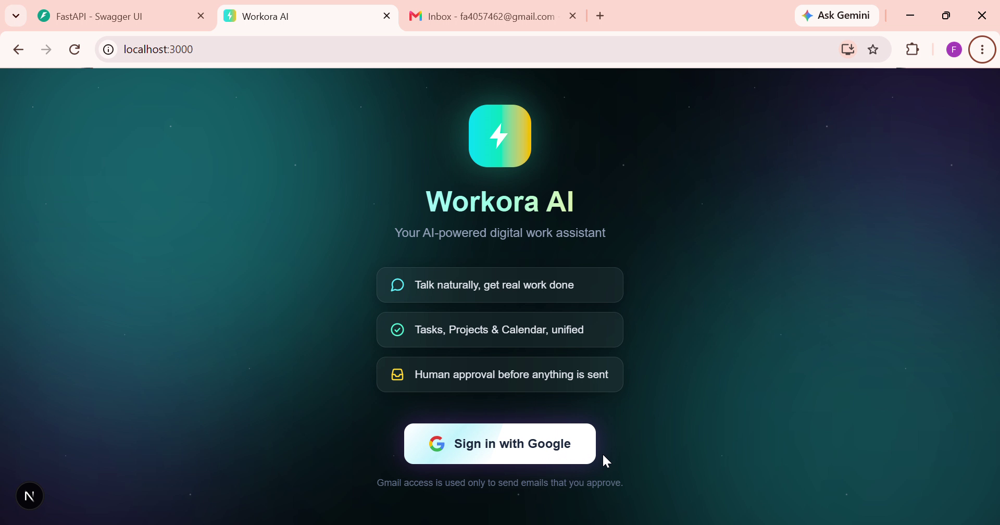
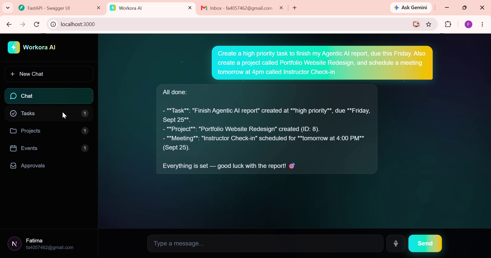
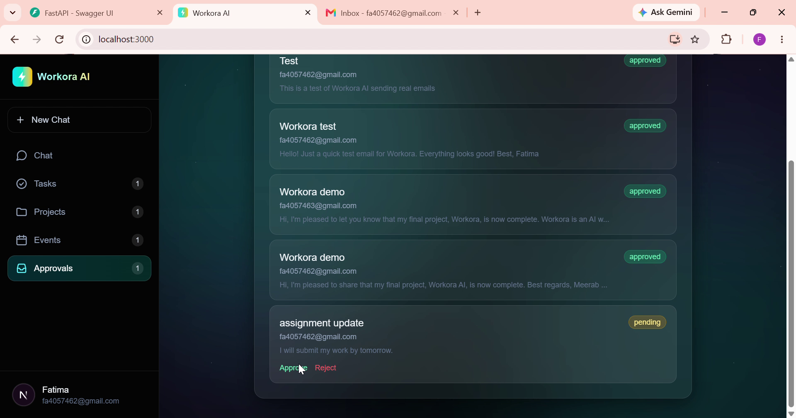

# Workora AI — Project Documentation

**Course:** Agentic AI  **Instructor:** Eman Yahya  **Student:** Meerab Fatima (BS Software Engineering)
**Submission date:** 23 September 2026

---

## Screenshots & Demo

**[Watch the full demo video](https://drive.google.com/file/d/1gajbytuNS1KKsLzBkrZoheQARO2Jyh-p/view?usp=drive_link)** — walks through login, natural-language task/project/event creation, the human-in-the-loop email approval flow, and knowledge base (RAG) search, all in one continuous chat.

*Recorded on 24 September 2026, the day after the (extended) 23 September submission deadline, to showcase later polish work: the updated cyan-teal-gold color scheme, multi-model fallback, and PWA install support. The core agent functionality shown was already complete and working at the time of submission.*

| Login | Task creation | Human-in-the-loop approval |
|---|---|---|
|  |  |  |

---

## 1. Why this project exists

People who study or work juggle tasks, deadlines, meetings, emails, documents and notes across many separate apps. Workora AI puts these in one place and lets the user control them by simply *talking* to an AI assistant, for example "create a high priority task to finish my report by Monday" or "draft an email to my teacher".

The project is built to demonstrate the core ideas of the Agentic AI course:

- an **agent** that decides which **tool** to call to get real work done (not just chat text)
- **human-in-the-loop** safety: the agent can draft an email, but nothing is sent until the human approves
- **memory**: short-term (the conversation) and long-term (saved preferences)
- **RAG** (retrieval-augmented generation): the agent answers from the user's own saved notes
- **real integrations**: Google Sign-In and the Gmail API
- **multi-user design**: each person only ever sees their own data

---

## 2. What the app can do

| Feature | How the user uses it | What really happens |
|---|---|---|
| Tasks | Ask in chat: "create a task ... due tomorrow" | Agent calls `create_task_tool`, saved with priority and due date; shown in the Tasks tab (can be deleted there) |
| Projects | "Create a project called ..." | Agent calls `create_project_tool`; shown in Projects tab |
| Events / calendar | "Schedule a meeting tomorrow at 3pm" | Agent converts the relative time to a real date and calls `create_event_tool`; shown in Events tab |
| Email with approval | "Draft an email to ... about ..." | Agent calls `draft_email_tool`, which only creates a **pending approval**. The user clicks Approve, and only then is the email sent through the user's own Gmail |
| Content writing | "Write an introduction for my assignment on ..." | Agent writes the full text in the chat |
| Spreadsheets | "Make an Excel sheet of my weekly study plan" | Agent builds a real `.xlsx` file with openpyxl; the chat shows a clickable download link |
| Long-term memory | "Remember that I prefer short answers" | Agent calls `remember_preference_tool`; the fact is stored and injected into every future conversation |
| Short-term memory | Follow-ups like "call it Report" | The last messages of the conversation are sent with every request |
| Knowledge base (RAG) | "Save this to my knowledge base ..." then "According to my knowledge base, ..." | Notes are chunked, turned into vectors, stored in pgvector, and searched by cosine similarity |
| Voice input | Microphone button | Browser speech recognition fills the chat box |
| Reminders | Account menu > Enable reminders | While the tab is open, the browser notifies about tasks due today and events starting within 15 minutes |
| Login | Sign in with Google | Real per-user accounts; see section 5 |

---

## 3. Architecture

```
 Browser (Next.js, localhost:3000)
   |  Bearer token (JWT) on every request
   v
 FastAPI backend (127.0.0.1:8000)
   |-- auth.py   Google OAuth + JWT session
   |-- main.py   REST endpoints (all filtered by the logged-in user)
   |-- agent.py  OpenAI Agents SDK agent + 9 tools (bound to one user)
   |-- rag.py    chunking, hashed embeddings, pgvector search
   |
   |--> Neon PostgreSQL (+ pgvector)     data for all users
   |--> LLM provider (OpenAI-compatible) via NVIDIA NIM, with automatic multi-model fallback
   |--> Google (OAuth + Gmail API)       sign-in and email sending
```

**Tech stack**

- Frontend: Next.js (TypeScript), Tailwind CSS
- Backend: FastAPI (Python), SQLAlchemy
- Database: PostgreSQL on Neon, with the pgvector extension
- Agent framework: OpenAI Agents SDK
- LLM: OpenAI-compatible endpoint via NVIDIA NIM, with **automatic multi-model fallback** — if the primary model (`nvidia/nemotron-3-ultra-550b-a55b`) is unavailable, the agent silently retries the next model in a prioritised list (GLM 5.3 Flash, Nemotron 3.5 Lightning 30B) before returning an error, so the app stays usable even when one model is temporarily unavailable
- Auth: Google OAuth 2.0 (openid, email, profile, gmail.readonly, gmail.send) and JWT sessions

---

## 4. How the agent works

1. The frontend sends the message plus recent history to `POST /agent/chat`.
2. The backend identifies the user from the token and calls `run_agent(message, user_id, history, user_name)`.
3. `run_agent` builds the agent's instructions: the base rules, today's real date (so "tomorrow" is calculated correctly), the user's name, and the user's saved long-term memories.
4. `build_tools(user_id)` creates the tool set **for that specific user**. Every tool saves and reads data under that user's id, so the AI can never touch another person's data.
5. The agent decides which tool to call (or just answers), the tool runs against the database, and the final answer is returned to the chat.

**The 9 tools:** `create_task_tool`, `create_project_tool`, `create_event_tool`, `draft_email_tool`, `generate_content_tool`, `create_spreadsheet_tool`, `remember_preference_tool`, `search_knowledge_base_tool`, `save_to_knowledge_base_tool`.

---

## 5. Login process (Google Sign-In + Gmail permission in one step)

Instead of a separate app-password step, one Google consent screen gives both identity and Gmail permission.

1. The user clicks **Sign in with Google**. The browser goes to `GET /auth/google/login`, which redirects to Google.
2. Google asks the user to choose an account and approve: basic profile, read Gmail, send Gmail.
3. Google redirects to `GET /auth/google/callback` with a one-time code.
4. The backend exchanges the code for tokens, reads the user's name, email and photo, and creates or updates the row in the `users` table. Google's **refresh token** is stored so the backend can later send email on the user's behalf.
5. The backend creates a signed **JWT session token** (valid 7 days) and redirects back to the frontend with it.
6. The frontend saves the token, removes it from the address bar, and sends it as `Authorization: Bearer <token>` on every call. `GET /auth/me` returns the user's name, email and photo for the sidebar.
7. **Logout** deletes the token in the browser. If any request comes back 401 (expired or invalid), the app logs out automatically.

When migration was done, all data that existed before login was given to the first user who signed in, so nothing was lost.

---

## 6. Human-in-the-loop email approval

```
User: "Email my teacher that I'll submit tomorrow"
  -> agent calls draft_email_tool   (creates an approval_request with status "pending"; sends nothing)
  -> Approvals tab shows the draft with Approve / Reject
  -> Approve: backend refreshes the user's Google access token and sends
     the message via the Gmail API as the user; status becomes "approved"
  -> Reject: status becomes "rejected"; nothing is sent
```

An approval can only be processed once, so a double click cannot send the email twice. The result (sent, or the exact error) is shown to the user as a message.

---

## 7. RAG (knowledge base)

- **Saving:** the note is split into overlapping chunks of about 120 words. Each chunk is converted to a 384-number vector and stored in the `knowledge_chunks` table (pgvector column).
- **Searching:** the question is converted the same way, and PostgreSQL returns the closest chunks by **cosine distance**, restricted to the current user's documents. The top 3 passages go to the agent, which answers from them and names the source document.
- **Honest note:** the vectors come from scikit-learn's `HashingVectorizer` (feature hashing of words), **not** a neural embedding model. Retrieval is therefore keyword-overlap based rather than deep semantic understanding. This was a deliberate trade-off to avoid large model downloads and API cost. Replacing `embed()` in `rag.py` with a neural embedding model is a small change.

---

## 8. Database

| Table | Purpose |
|---|---|
| `users` | id, email, name, picture, google_refresh_token, created_at |
| `tasks` | title, priority, status, due_date, user_id |
| `projects` | name, status, user_id |
| `events` | title, event_time, user_id |
| `approval_requests` | action_type, recipient, subject, body, status, user_id |
| `user_memories` | long-term facts per user |
| `knowledge_documents` | saved notes/documents per user |
| `knowledge_chunks` | chunk text + 384-dimension embedding (pgvector) |

---

## 9. API endpoints (all except the first four require a login token)

- Public: `GET /`, `GET /db-check`, `GET /auth/google/login`, `GET /auth/google/callback`
- Session: `GET /auth/me`
- Tasks: `POST/GET /tasks`, `GET/PUT/DELETE /tasks/{id}`
- Projects: `POST/GET /projects`, `DELETE /projects/{id}`
- Events: `POST/GET /events`, `DELETE /events/{id}`
- Approvals: `GET /approvals`, `POST /approvals/{id}/approve`, `POST /approvals/{id}/reject`
- Knowledge: `POST/GET /knowledge`, `POST /knowledge/search`, `DELETE /knowledge/{id}`
- Agent: `POST /agent/chat`
- Files: `GET /files/{filename}` (generated spreadsheets; public link with a random id in the filename)

Every query is filtered by `user_id == current_user.id`.

---

## 10. Interface design

**Layout:** a left sidebar (like Claude, ChatGPT or Notion) with Chat, Tasks, Projects, Events and Approvals as separate panels, with count badges. The account area (photo, name, email, menu with reminders and logout) sits at the bottom of the sidebar. In the Chat panel the input box is pinned to the bottom of the screen and the conversation scrolls above it, jumping to the newest message.

**Colour scheme, "Bioluminescent":**

- Background: near-black deep-space navy, with a faint cyan-lead / violet-secondary ambient glow (violet is used only as a dim background accent, not a primary colour)
- Primary gradient: cyan to teal to gold (`cyan-400 -> teal-400 -> amber-400`), used for the logo, Send button, user chat bubbles, headings and the login button glow
- Text accents: soft cyan, teal and gold tints; section icons use cyan, teal and gold to tell Tasks/Projects/Events/Approvals apart
- Cards: frosted glass (`bg-white/5`, `border-white/10`, backdrop blur)
- Destructive actions (delete): red, for a clear, standard warning colour
- Status colours: emerald for approved, red for rejected, gold for pending

**PWA (installable app):** the app has a `manifest.json`, an installable app icon (matching the in-app logo's cyan-teal-gold gradient), and a service worker, so it can be installed to a device's home screen/desktop and opens full-screen with no browser bars. This is an installable **shell** only — it does not yet support full offline use of tasks, chat, or data (an internet connection is still required).

---

## 11. Security notes

- Secrets (`.env`) are never committed; `.gitignore` excludes them, the virtual environment and generated files.
- Every endpoint checks the JWT and filters data by user, so one user cannot read another's tasks, notes or approvals.
- Email is never sent without the user's explicit approval.
- Known trade-offs: the session token is stored in the browser's localStorage; generated spreadsheet links are public but use random ids.

---

## 12. What has been tested

Tested manually by the author:
- Google sign-in, and old data still visible after the migration
- Asking the agent to create a task, which then appears in the Tasks tab
- Draft email > Approve > email actually received in Gmail
- Knowledge base: saved a note in chat, then asked a question and got an answer from it

Not yet re-tested after the later polish work (color scheme, multi-model fallback, PWA): reminders notification, logout, spreadsheet download, and long-term memory, plus a second Google account to confirm data isolation still holds.

---

## 13. Known limitations

- The Google OAuth app is in **Testing** mode: only accounts added as test users can sign in. A public launch needs Google's verification review for the Gmail scopes.
- The LLM endpoint (NVIDIA NIM) has a usage quota; when exhausted the agent tries fallback models before returning an error.
- RAG uses hashed keyword vectors, not neural embeddings (see section 7).
- Reminders work only while the browser tab is open.
- The UI lists and deletes tasks, projects and events; creating them is done through the chat (the agent) or the API. Task editing is available through the API only.
- The knowledge base is used through the chat; there is no upload screen yet.

## 14. Project structure

```
Workora-AI/
  docs/
    screenshots/
      login-screen.png
      chat-task-creation.png
      approvals-pending.png
  backend/
    main.py             API routes
    agent.py            agent, tools, memory, multi-model fallback
    auth.py             Google OAuth + JWT
    rag.py              knowledge base
    models.py           database tables
    database.py         connection to Neon
    requirements.txt
    .env.example        template — copy to .env and fill in real values
    .env                (private, not in git)
  frontend/
    app/
      page.tsx          whole interface
      layout.tsx        links the manifest, icons, and service worker
      globals.css
    public/
      manifest.json     PWA config
      sw.js             service worker (installable shell)
      icons/            app icons (matches the in-app logo gradient)
    .env.local.example  template — copy to .env.local if deploying
    package.json
```

## 15. How to run

**Backend:** `cd backend`, create and activate a virtual environment, `pip install -r requirements.txt`, copy `.env.example` to `.env` and fill in real values (database URL, `NVIDIA_API_KEY`, `GOOGLE_CLIENT_ID`, `GOOGLE_CLIENT_SECRET`, `JWT_SECRET`, `BACKEND_URL`, `FRONTEND_URL` — the defaults for the last two already work for local development and only need to be changed to the real deployed URLs once the app goes live), then `uvicorn main:app --reload`.

**Frontend:** `cd frontend`, `npm install`, `npm run dev`, then open `http://localhost:3000`. (`.env.local.example` is only needed once the backend is deployed somewhere other than `127.0.0.1:8000`.)

**Google Cloud:** enable the Gmail API, create a Web OAuth client with origin `http://localhost:3000` and redirect URI `http://127.0.0.1:8000/auth/google/callback`, and add your account as a test user.